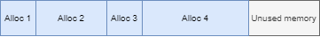
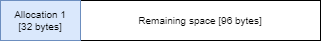

# Linear Allocator

A linear allocator allocates memory one after another in a contiguous block. Deallocating a specific area of memory is not supported. Instead, the user releases all the memory when the its is no longer needed.

## Terms
### Block
A contiguous region of memory. A block is dynamically allocated upfront and all further allocations utilize memory from the block. This minimizes runtime dynamic allocations.


## Member variables
- `m_BlockPtrs` - Pointers to the the start of all the allocated blocks.
- `m_CurrentStartAddress` - The starting address of the the block that is currently being used for allocations.
- `m_BlockSize` - The size of each block.
- `m_CurrentOffset` - The offset of the next allocation from the start of the current block.

## Initialization
1. Call `AllocateBlock` to allocate a new block of memory

## Allocate
1. Get address of the next available memory location: 
```c++
baseAddress = m_CurrentStartAddress + m_CurrentOffset
```
2. Get the `alignedAddress` and calculate padding:
```c++
padding = alignedAddress - baseAddress
```
3. Calculate the used size (of the block) after the allocation and set `m_CurrentOffset` equal to it:
```c++
totalSizeAfterAllocation = m_CurrentOffset + padding + allocationSize
m_CurrentOffset = totalSizeAfterAllocation
```
4. If the used size is greater than the block size, call `AllocateBlock` to allocate a new block of memory and call `Allocate` again.
3. Return the aligned address

## Example
We start off by dynamically allocating a single block of `128 bytes`:


We start using the allocator by allocating a new object of `32 bytes`:


