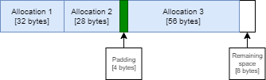
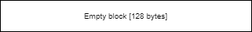

# Linear Allocator

Also known as a monotonic allocator. A linear allocator allocates memory one after another in a contiguous block. Deallocating a specific area of memory is not supported. Instead, the user releases all the memory when its no longer needed. 

## Terms
### Block
A contiguous region of memory. A block is dynamically allocated upfront and all further allocations utilize memory from the block. This minimizes runtime dynamic allocations.


## Member variables
- `m_BlockPtrs` - Pointers to the the start of all the allocated blocks.
- `m_CurrentStartAddress` - The starting address of the the block that is currently being used for allocations.
- `m_BlockSize` - The size of each block.
- `m_CurrentOffset` - The offset of the next allocation from the start of the current block.

## Example
The user creates a new `LinearAllocator` with a block size of `128 bytes`. We start by dynamically allocating a single block of `128 bytes`. Suppose this block starts at address `0`:


We start using the allocator by allocating a new object of `32 bytes`:


Then use another `28 bytes`:


`m_CurrentOffset` is now `60`. We now want to allocate another `56 bytes`. Suppose the [alignment requirement](../../Utility/Alignment/README.md#alignment-requirement) of this allocation is `8 bytes`. The current offset isn't a multiple of 8 so we have to add a padding of `4 bytes` before the allocation so it starts at `64`:



We now want to use another 32 bytes. But there isn't enough memory left in the block. If the allocator policy contains `Growable`, we dynamically allocate another block of size `128 bytes`. Otherwise, an out of memory error is shown.


We now decide that we don't want the allocated data anymore. So we call `Release` to remove all the blocks except the first and empty the first block:




## Details
### `Constructor`
1. Call [`AllocateBlock`](#allocateblock) to allocate a new block of memory.

### `Allocate`
1. Get address of the next available memory location: 
```c++
baseAddress = m_CurrentStartAddress + m_CurrentOffset
```
2. Align the base address and used the aligned address to calculate padding:
```c++
padding = alignedAddress - baseAddress
```
3. Calculate the used size (of the block) after the allocation and set `m_CurrentOffset` equal to it:
```c++
totalSizeAfterAllocation = m_CurrentOffset + padding + allocationSize
m_CurrentOffset = totalSizeAfterAllocation
```
4. If the used size is greater than the block size, call [`AllocateBlock`](#allocateblock) to allocate a new block of memory and call [`Allocate`](#allocate) again.
3. Return the aligned address

### `AllocateBlock`
1. Allocate a new block of memory of size `m_BlockSize` using `malloc`.
2. Add the address of the new block to `m_BlockPtrs`.
3. Set `m_CurrentStartAddress` to the address of the new block.
4. Set `m_CurrentOffset` to `0`.


### `Release`
1. Free every block except the first one by calling `free` on every pointer in `m_BlockPtrs` except the one at index `0`.
2. Set `m_CurrentStartAddress` to the address of the first block.
3. Set `m_CurrentOffset` to `0`.

### `Destructor`
1. Free every block by calling `free` on every pointer in `m_BlockPtrs`.

## Further readings
- https://vector-of-bool.github.io/2018/11/06/dumbest-allocator.html
